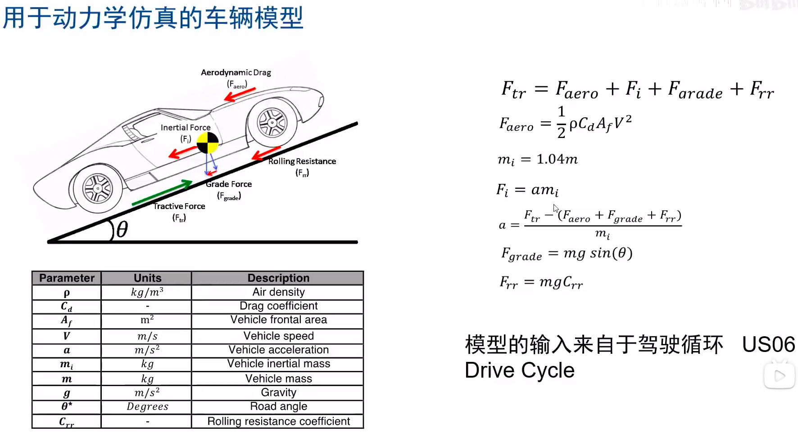

# 动力学仿真

## 仿真

### 基于工况的simulink整车仿真建模

#### 理论基础

#### 用于仿真的车辆模型

> 公式一表示斜坡匀速或静止状态
  
|  符号  |  意义  |
| -- | -- |
| $F_{tr}$ |　牵引力力 |
| $F_{aero}$ | 空气阻力|
| $F_{rr}$   | 滚动摩擦力　|

- 仿真
  

### 动力学系统模块
- 车辆模型
- VCU
- 驾驶员模型

